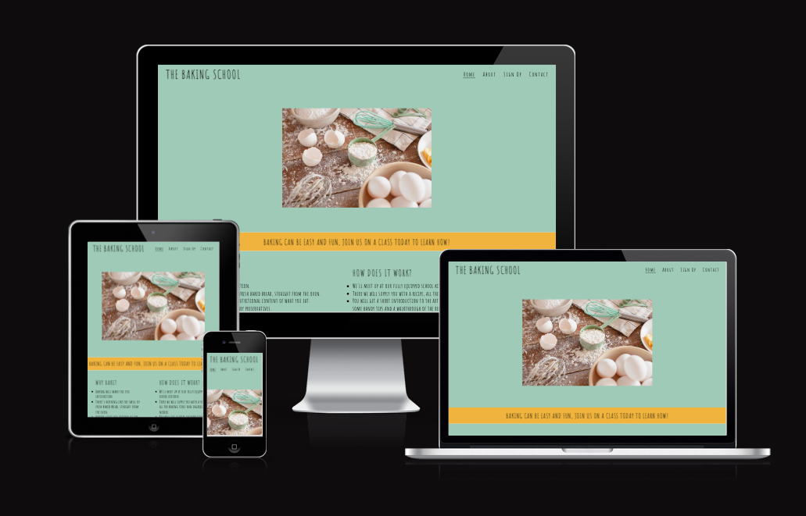
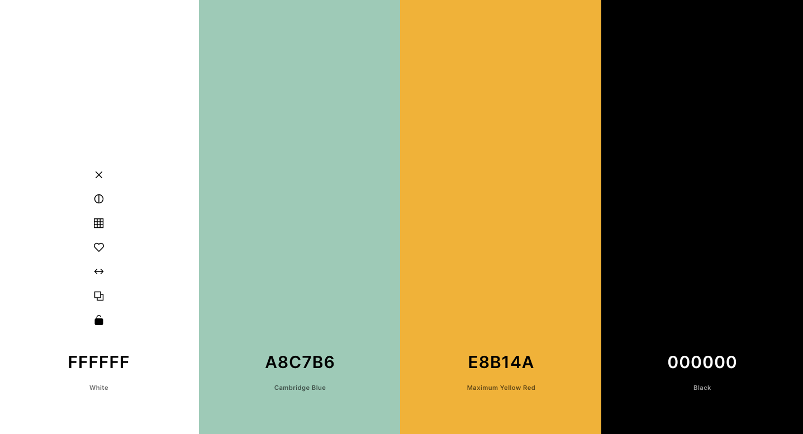
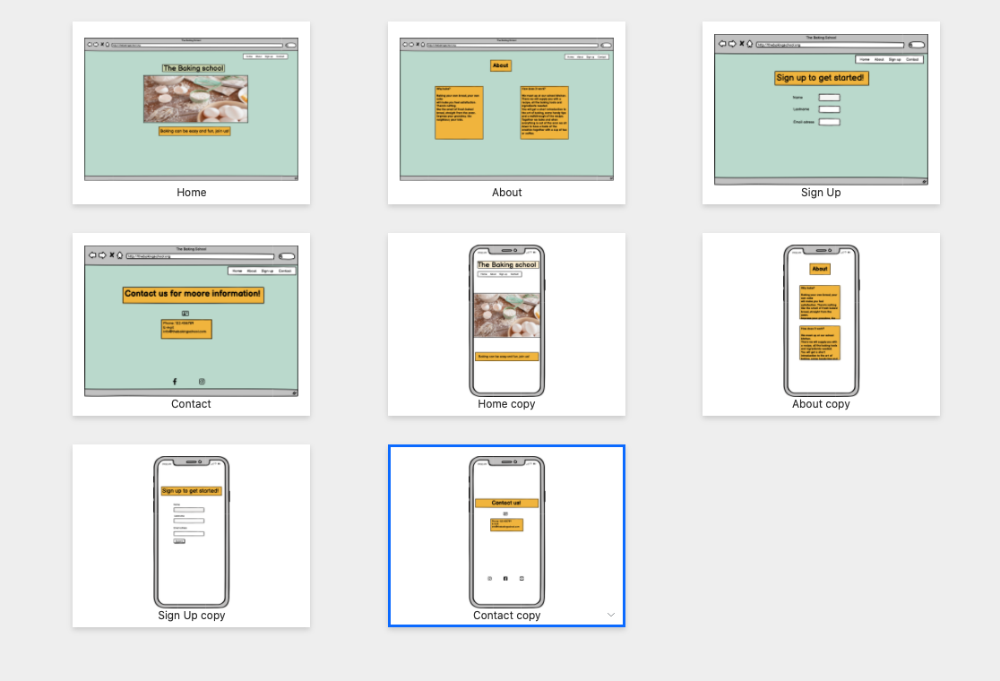
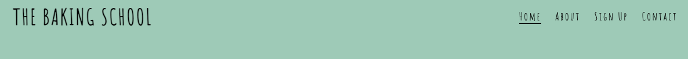
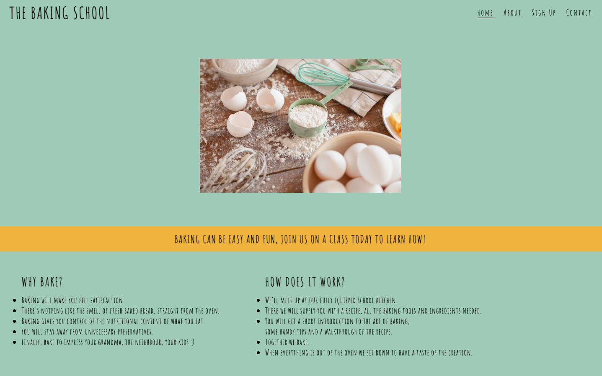
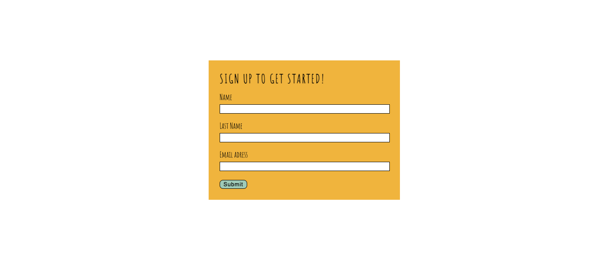
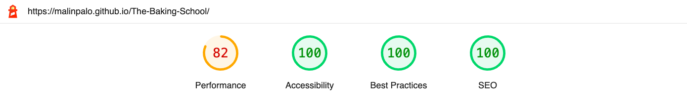

# The Baking School
The Baking School Website is a plattform for people who are curiose about how to bake, that never have baked, that might think that baking is difficult and boring.

The Baking School offers classes in easy and fun baking.  
In a typicall class the teacher gives the student a easy recipe, tools like ingridients and kitchen utensils, a walktrough of the recipe. Then the student gets to bake with assistance of the teacher.

Users of the website will get all the information they need about the school, how to sign up and how to contact the school.

[Live link to the Website](https://malinpalo.github.io/The-Baking-School/?fbclid=IwAR1NLY9A7RSG0S5xpstybVzHx16jNqLt2F0ort452kt_tjy8LRLNyokhnNg)

## User experience (UX) 
### First Time Visitor Goals:
* I want to be abel to easily navigate troughout the website.
* I want to be abel to view the website troughout different devices.
* I want to easily get a clear picture of what the website offers and how to take part.
* I want to easily find out where The Baking School are on Facebook, Instagram and Youtube.

### Returning Visitor Goals: 
* I want to be abel to contact the school for another class or any questions I might have.

### Frequent Visitor Goals
* I want to easily take contact with the School to sign up for another class. 

## Design

### Color Scheme
 * The color scheme for this page was taken from [Coloor](https://coolors.co/palette/ffffff-b2cdbe-76a78c-e8b34d-000000).
 The color scheme where picked out after rending the homepage picture in [Coloor](https://coolors.co/palette/ffffff-b2cdbe-76a78c-e8b34d-000000) to make a nice structure and visibility for the website.
  

### Typography
 * The font for this page was taken from [google fonts](https://fonts.google.com/).
   * The font Amatic SC was used throughout the whole website. 

### Wireframes
* To get an owerviev of how the website will look I used Wireframes.

## Features

* Throughout the whole website: 
  * The website is designed with focus on getting good visibility. 
  * The text stands out from the background with contrast and different background colors are used to increase the accessibility and clarity of the website.

  * Every section is responsive in shape and size depending on different screen sizes. 

* Navigation
  * A logo with the name of the website is located to the top left of the page.
  * A navigation bar with navigation links to Home, About, Sign Up and Contact, is located up on the top right of the page.
  * The navigation links takes you to the prefferable section on the page.
  * The user can easily find information on the website using the navigation.
  

* The HomePage Section and About Section.
  * The homepage shows a picture of baking.
  * The homepage text explains that users can join a class to learn how to bake and that baking can be easy and fun.
  * The user gets clear information about what the website and school is all about, why they should choose The Baking School and how the school works.

 * The Sign Up Section
   * The Sign Up Section contains of a form with required fields for users to fill in, Name, Lastname, E-mail.
   * The form has a submit button in the end. Users will have to fill in all fields to be abel to submit.
   * The Sign up section gives users the ability to sign up for a class.
   

 * The Contact Section
   * The Contact Section provides users with a telefon number and a e-mail adress to encourage users to take contact.
   * The user can easily contact The Baking School with questions or other requirements.
   
  
* The Footer Section
  * The Footer Section includes icons that links the user to The Baking School on social media such as Instagram,Facebook and Youtube.
  * The Footer Section allows user to get connected with The Baking School at social media.
  

* Missing links
  * The submit button links you back to the homepage since the right direction doesn´t exist by today. 
* Features Left To Implement
  * I would like to add javascript animation in every section that easily brings the user back to the homepage.
  * I would like to add a image in The About section.
  * I would like to add a gallery with pictures of the teatchers and baking.
  * I would like to add a price list.
  * I would like to add a "subscribe to our newsletter" crossbox in The Form Section.
## Accessibility

* Semantic markup Is used throughout the whole website.

## Technologies Used

### Laguage used

* HTML and CSS

### Frameworks, Libraries & Programes Used

* [Balsamiq](https://balsamiq.com/) was used to create the wireframes for this project.
* [Git](https://git-scm.com/) was used for version control.
* [Github](https://github.com/) was used to save and store project's code.
* [Google Fonts](https://fonts.google.com/) was used to import the fonts used on the website.
* [Font Awesome](https://fontawesome.com/) was used for the icons on this page.

## Deployment & Local Development

### Deployment

This website was deployed to GitHub Pages by following steps:
* Log in to GitHub
* Go to the setting for this repository.
* Select pages in left hand navigation menu.
* From the source dropdown, select main branch and then press save.
* The site will be deployed now. It may take a few minutes to go live.

## Testing
### W3C Validator testing
* HTML - No error where found when running the website through the
[W3C validator.](https://validator.w3.org/nu/?showsource=yes&doc=https%3A%2F%2Fmalinpalo.github.io%2FThe-Baking-School%2F#l36c27)

* CSS - No errors where found when running the website through the [jigsaw validator.](https://jigsaw.w3.org/css-validator/validator?uri=https%3A%2F%2Fmalinpalo.github.io%2FThe-Baking-School%2F&profile=css3svg&usermedium=all&warning=1&vextwarning=&lang=sv#css) 

### Performance and Accessibility Testing
* [Lighthouse](https://web.dev/measure/?url=https%3A%2F%2Fmalinpalo.github.io%2FThe-Baking-School%2F) was used to test for performance and accessibilty. Following scores and issues where found: [Lighthouse scores](https://googlechrome.github.io/lighthouse/viewer/).

## Solved Bugs
  * ERROR when pushing "submit" button". Solved this by changing "METHOD" to "GET".
  
## Testing User Stories
* The website where checked by family and friends on different devices.

* The website is responsive to different screen sizes and works well on every other device.

* The site was successfully tested on different browsers like Chrome, Safari and Firefox.

* The navigationbar links perfectly to the different sections in the Webpage.

* The footer links works perfectly and opens up on new pages.

* The "Submitt" button works perfectly and links to the homepage. 
  

## Credits
### Code Used
 * Some of the code used for the Logo, footer and navigation bar was taken from the "Loverunning" project with some changes to fit my project.
 
### Media
* The image on the Homepage is taken from [Pexels](https://www.pexels.com/).
* The icons for The Contact section and The Footer section were taken from Font Awesome.

### Content
* Some of the information in the about section is taken from the website [Dietistannica](https://dietistannica.com/2015/05/02/5-fordelar-med-att-baka-ditt-eget-brod/).

### Acknowledgments
* The site was completed as a Portfolio 1 Project for the Full Stack Software Developer (e-Commerce) Diploma at the Code Institute. 
* I would like to thank friends and family, my mentor Spencer Barriball, Slack community, and all at the Code Institute for their help and support.

Malin Palo 2022.

